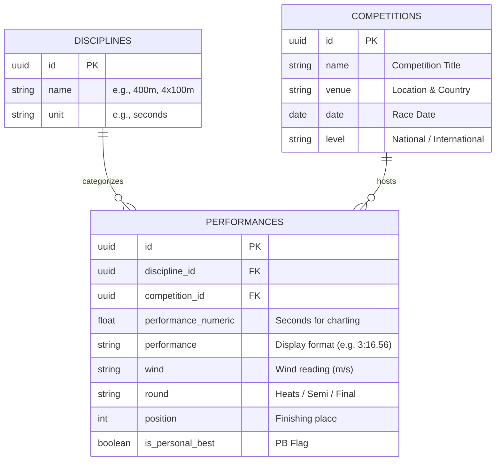

# Jiro Prudencio — Full-Stack Developer Portfolio & Project Showcase

Welcome to my personal developer portfolio! This project serves as a showcase of my full-stack engineering skills, data science workflows, and technical projects. As a key design decision to personalize the experience and present data creatively, the website features a custom, constellation-themed athletic performance dashboard that tracks my sprint progression (100m, 200m, 400m, and relays) since 2016.

Live Demo: `[Deploying soon via Vercel]`

---

## 🎯 Project Purpose

This repository is a structured milestone in my software engineering and data science journey. It was designed to achieve four key goals:

1. **Agentic Workflows**: Getting hands-on experience using the **Google Antigravity IDE** and orchestrating autonomous AI agent developer workflows (PM, Full-Stack Engineer, QA, and DevOps roles).
2. **Re-learning Full-Stack Development**: Serving as an intensive technical refresher following a **two-year hiatus** during my National Service enlistment in the Singapore Armed Forces (July 2024 – July 2026) after graduating from Singapore Polytechnic.
3. **Mastering Version Control**: Facing previous areas of friction (Git & GitHub workflows) head-on by enforcing Conventional Commits, feature branching, pull request merges, environment management, and CI/CD pipelines.
4. **Demonstrating Industry Readiness**: Showcasing professional developer traits valued in university programs and entry-level positions:
   - **Full-Stack Portfolio Focus**: Presenting clean, modular layouts highlighting my real-world projects, professional experience, education, and credentials.
   - **Data-First Mindset**: Normalizing complex datasets (sprint performance logs) from flat Excel configurations into a relational PostgreSQL schema, complete with scripted database migrations and seeds.
   - **Creative Design Decisions**: Designing a unique user experience using a custom constellation theme for charts (glowing nodes, low-opacity strokes, and gold radial-glow filters for Personal Bests) to showcase visual UI engineering.
   - **Quality-Centric Code**: Building under TypeScript strict mode with `noUncheckedIndexedAccess` enabled, eliminating all `any` types, and ensuring WCAG AA color contrast accessibility on dark backgrounds.

---

## 💻 Tech Stack & Architecture

| Layer | Technology | Purpose |
|---|---|---|
| **Framework** | Next.js 16 (App Router) | Server-side rendering, routing, & static generation |
| **Language** | TypeScript | Strict compile-time type-safety & structure |
| **Styling** | Tailwind CSS v4.3 | Responsive layouts & custom dark theme styling |
| **Components** | shadcn/ui + Framer Motion | Accessible layout building & subtle micro-animations |
| **Data Viz** | Recharts | Dynamic custom-themed performance charts |
| **Database** | Supabase (PostgreSQL) | Relational database serving normalized race data |
| **Deployment** | Vercel | Production deployment & hosting |
| **Package Manager**| pnpm | Fast, disk-efficient dependency resolution |

### Relational Schema (Supabase)

---

## 🛠️ Project Progression

The project is structured into **four development phases** to simulate industry release patterns:

*   **Phase 1: Static Frontend (Completed)**
    *   Initial project skeleton initialized using `pnpm` and Next.js 16.
    *   Setup of globals.css containing CSS-only starfield background and design variables.
    *   TypeScript models defined, and mock layouts prepared.
    *   Custom Recharts integration built to invert time progressions (faster times appear higher) and highlight personal bests with a gold radial glow.
*   **Phase 2: Backend API Layer (In Progress)**
    *   Next.js API routes serving JSON endpoints.
    *   Refactoring components to fetch dynamically via React hooks.
*   **Phase 3: Supabase Integration**
    *   PostgreSQL schema migration and RLS policies setup.
    *   Data pipeline script: parsing raw Excel data, mapping rows, and seeding tables.
*   **Phase 4: Vercel Deploy & Release**
    *   Deploy live environment to Vercel.
    *   Integrate GitHub Actions for automatic staging and builds on merge.

---

## 🏃 About Me

I am an incoming university student and data apprentice with a passion for AI/ML pipelines and full-stack engineering. 

When I am not coding, I compete as a sprinter in Singapore (focusing on the 400m). This project is a convergence of both my passions: the discipline of sprint metrics meets the analytical rigor of software development.
